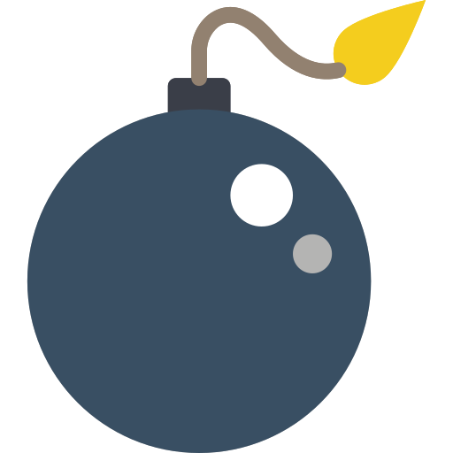
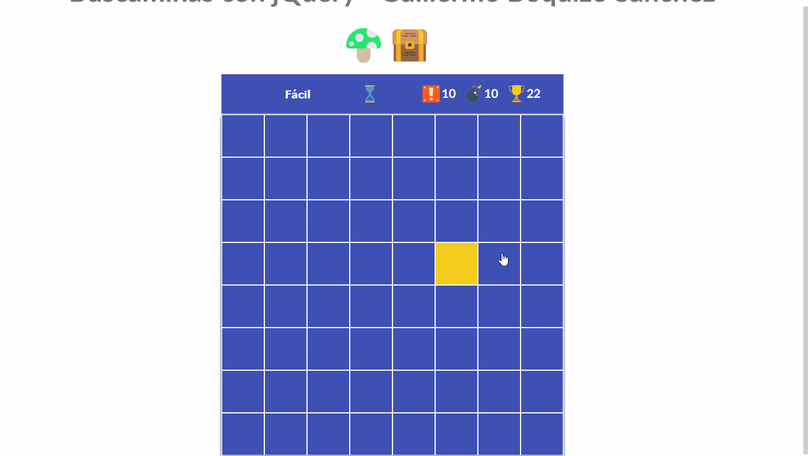
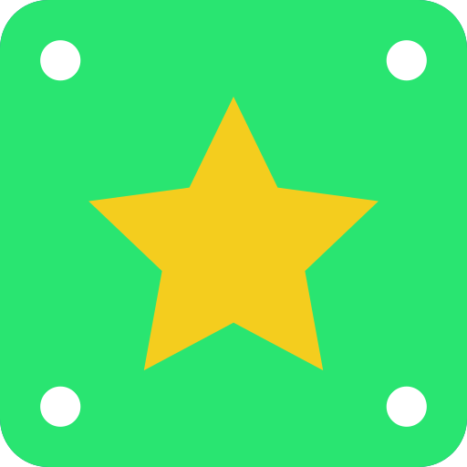
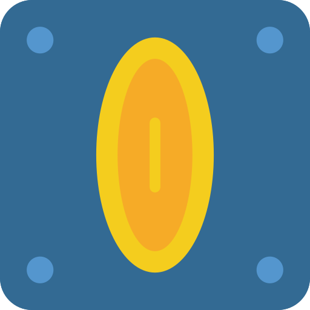
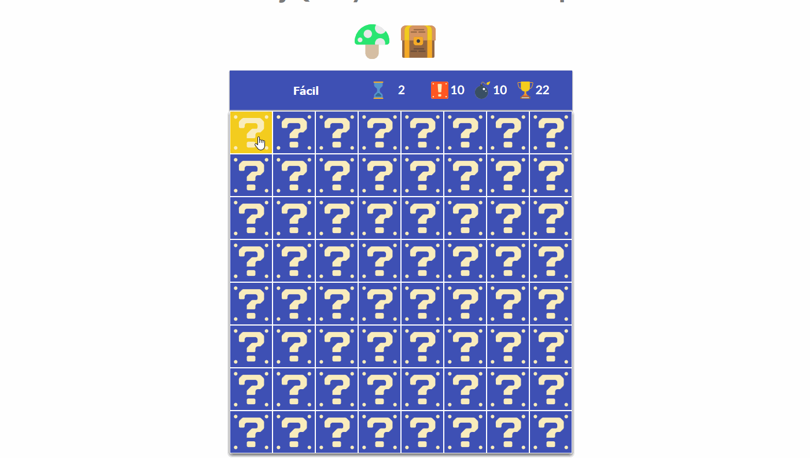
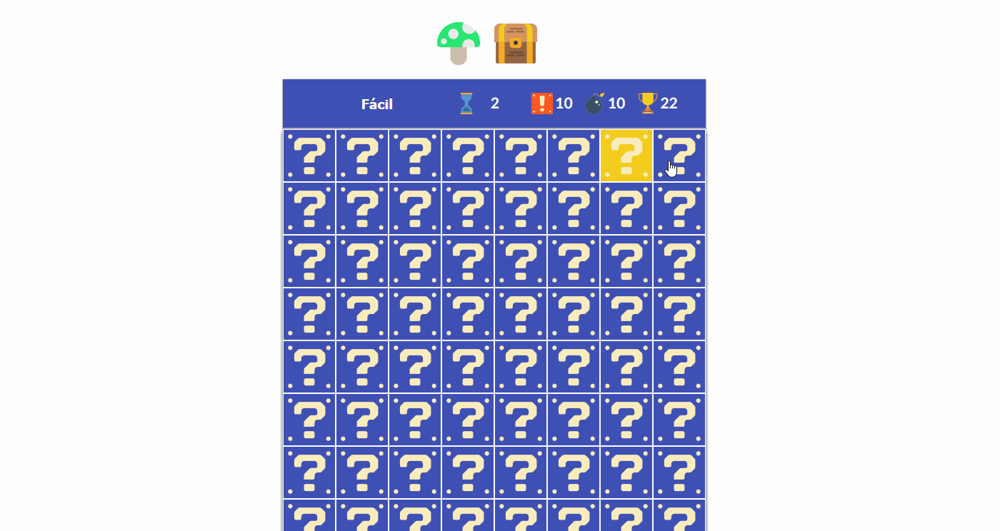
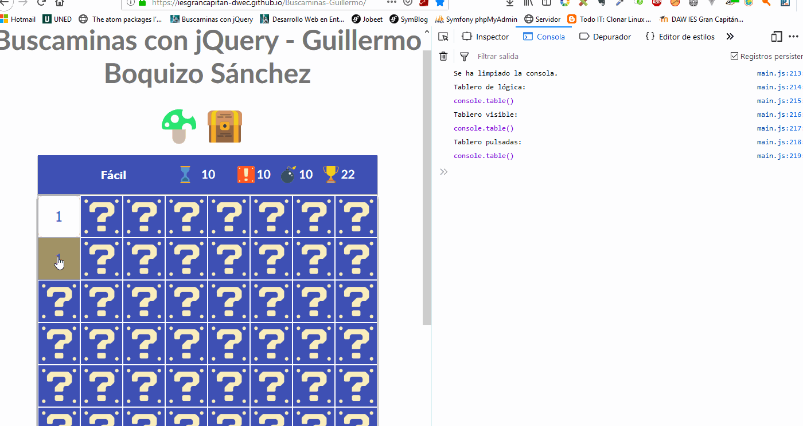
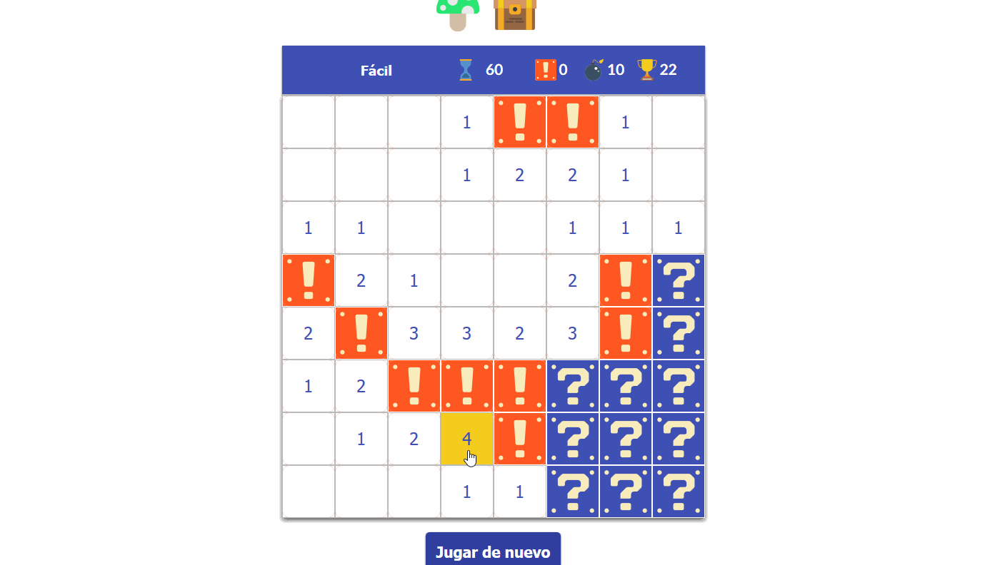
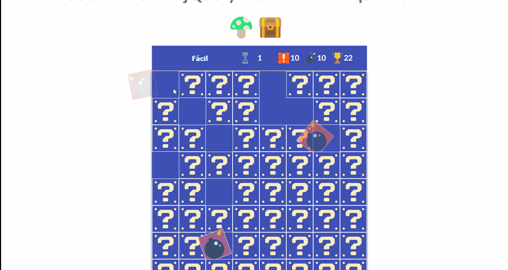

 Buscaminas con jQuery 
----
Para jugar entra en [Buscaminas con jQuery](https://iesgrancapitan-dwec.github.io/Buscaminas-Guillermo/)

**********

####  Estoy haciendo pruebas, ¿puedo ver el tablero? 

Sí, para ello **selecciona el nivel de juego**, accede al modo consola del navegador e introduce ```buscaminas.mostrar()```.



**********

####  Efectos jQuery implementados 

**********
####  Click (Al abrir una casilla) 
 [Invocación del efecto](https://github.com/iesgrancapitan-dwec/Buscaminas-Guillermo/blob/master/js/gui.js#L79)

 [Función que lo implementa](https://github.com/iesgrancapitan-dwec/Buscaminas-Guillermo/blob/master/js/gui.js#L102)

 [Efecto jQuery](https://github.com/iesgrancapitan-dwec/Buscaminas-Guillermo/blob/master/js/gui.js#L226)




**********
####  Click derecho (Añade o retira una bandera) 

 [Invocación del efecto](https://github.com/iesgrancapitan-dwec/Buscaminas-Guillermo/blob/master/js/gui.js#L84)

 [Función que lo implementa](https://github.com/iesgrancapitan-dwec/Buscaminas-Guillermo/blob/master/js/gui.js#L130)

 [Efecto jQuery](https://github.com/iesgrancapitan-dwec/Buscaminas-Guillermo/blob/master/js/gui.js#L137)




**********

#### Click con ambos botones (despejar)

 [Invocación del efecto](https://github.com/iesgrancapitan-dwec/Buscaminas-Guillermo/blob/master/js/gui.js#L87)

 [Función que lo implementa](https://github.com/iesgrancapitan-dwec/Buscaminas-Guillermo/blob/master/js/gui.js#L163)

 [Efecto jQuery](https://github.com/iesgrancapitan-dwec/Buscaminas-Guillermo/blob/master/js/gui.js#L173)




**********

#### Ganar

 [Invocación del efecto en picar](https://github.com/iesgrancapitan-dwec/Buscaminas-Guillermo/blob/master/js/gui.js#L115)

 [Invocación del efecto en marcar](https://github.com/iesgrancapitan-dwec/Buscaminas-Guillermo/blob/master/js/gui.js#L149)

 [Invocación del efecto en despejar](https://github.com/iesgrancapitan-dwec/Buscaminas-Guillermo/blob/master/js/gui.js#L181)

 [Apertura de un Swal 2 al ganar](https://github.com/iesgrancapitan-dwec/Buscaminas-Guillermo/blob/master/js/gui.js#L183)

 [Efecto jQuery](https://github.com/iesgrancapitan-dwec/Buscaminas-Guillermo/blob/master/js/gui.js#L348)



**********
#### Perder

 [Invocación del efecto en picar](https://github.com/iesgrancapitan-dwec/Buscaminas-Guillermo/blob/master/js/gui.js#L111)

 [Invocación del efecto en marcar](https://github.com/iesgrancapitan-dwec/Buscaminas-Guillermo/blob/master/js/gui.js#L146)

 [Invocación del efecto en despejar](https://github.com/iesgrancapitan-dwec/Buscaminas-Guillermo/blob/master/js/gui.js#L178)

 [Función que lo implementa](https://github.com/iesgrancapitan-dwec/Buscaminas-Guillermo/blob/master/js/gui.js#L496)

 [Apertura de un Swal 2 al perder](https://github.com/iesgrancapitan-dwec/Buscaminas-Guillermo/blob/master/js/gui.js#L543)

 [Efecto jQuery](https://github.com/iesgrancapitan-dwec/Buscaminas-Guillermo/blob/master/js/gui.js#L354)


